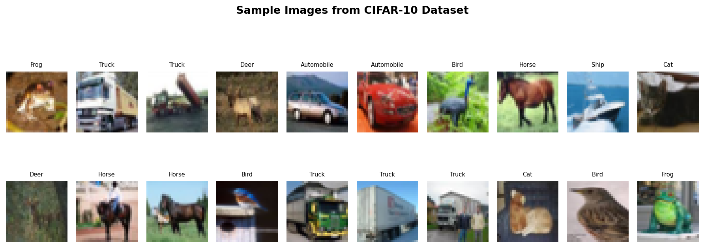
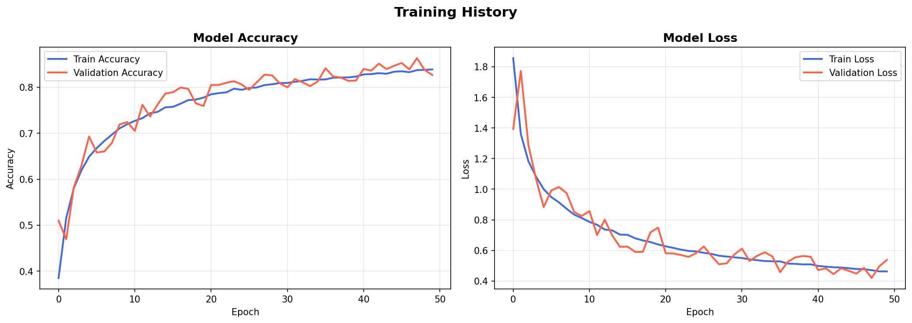
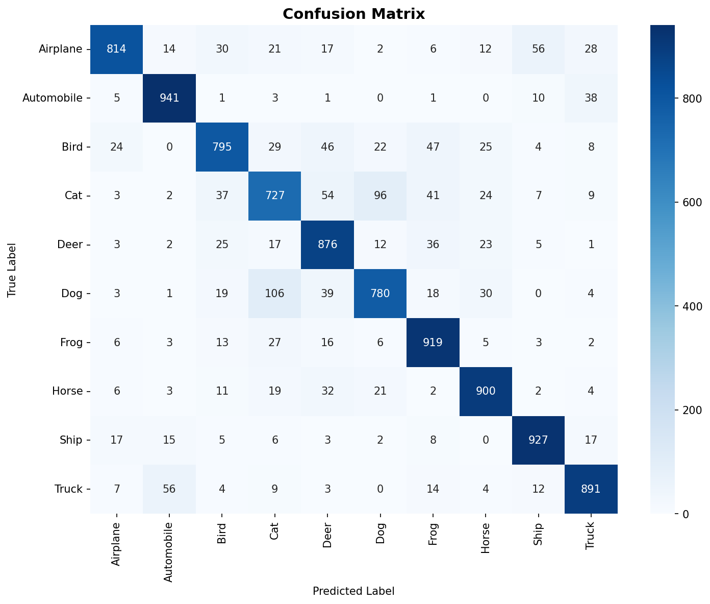
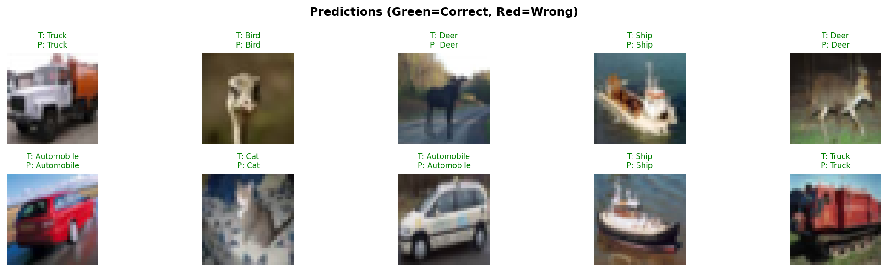

# CNN Image Classification on CIFAR-10

## 🔍 Project Title
**Deep Learning-Based Image Classification using Convolutional Neural Networks (CNN)**

---

## 📌 Problem Statement
Automatically classifying images into predefined categories is a core challenge in computer vision. This project implements a CNN-based image classifier trained on the CIFAR-10 dataset to accurately identify 10 different object categories from 32×32 color images.

---

## 🛠️ Tools & Technologies Used
| Tool | Purpose |
|------|---------|
| Python 3.x | Programming language |
| TensorFlow / Keras | Deep learning framework |
| NumPy | Numerical computations |
| Matplotlib | Plotting and visualization |
| Seaborn | Confusion matrix heatmap |
| Scikit-learn | Classification metrics |
| Jupyter Notebook | Interactive development |

---

## 📁 Project Structure
```
ImageClassification_RollNo/
│
├── image_classification.ipynb   # Jupyter Notebook (main project)
├── train.py                     # Plain Python script version
├── requirements.txt             # All required libraries
├── README.md                    # This file
│
├── saved_model/
│   └── best_model.keras         # Best model saved during training
│
└── screenshots/
    ├── sample_images.png        # Sample CIFAR-10 images
    ├── training_history.png     # Accuracy & Loss curves
    ├── confusion_matrix.png     # Confusion matrix heatmap
    └── predictions.png          # Sample predictions
```

---

## 🚀 Installation & Setup

### 1. Clone the repository
```bash
git clone https://github.com/YOUR_USERNAME/ImageClassification_RollNo.git
cd ImageClassification_RollNo
```

### 2. Create and activate a virtual environment
```bash
python3 -m venv venv
source venv/bin/activate
```

### 3. Install dependencies
```bash
pip install -r requirements.txt
```

### 4. Run the project

**Option A – Jupyter Notebook (recommended)**
```bash
jupyter notebook image_classification.ipynb
```

**Option B – Python script**
```bash
python3 train.py
```

---

## 📊 Dataset: CIFAR-10
- **60,000** color images (32×32 pixels)
- **10 classes**: Airplane, Automobile, Bird, Cat, Deer, Dog, Frog, Horse, Ship, Truck
- **50,000** training images | **10,000** test images
- Automatically downloaded by TensorFlow on first run

---

## 🧠 CNN Architecture
```
Input (32×32×3)
      ↓
Data Augmentation (RandomFlip, RandomRotation, RandomZoom)
      ↓
Conv Block 1: Conv2D(32) → BatchNorm → Conv2D(32) → BatchNorm → MaxPool → Dropout(0.25)
      ↓
Conv Block 2: Conv2D(64) → BatchNorm → Conv2D(64) → BatchNorm → MaxPool → Dropout(0.25)
      ↓
Conv Block 3: Conv2D(128) → BatchNorm → Conv2D(128) → BatchNorm → MaxPool → Dropout(0.25)
      ↓
Flatten → Dense(512) → BatchNorm → Dropout(0.5)
      ↓
Output: Dense(10, softmax)
```

---

## 📈 Output Screenshots

### Sample Dataset Images


### Training History (Accuracy & Loss)


### Confusion Matrix


### Sample Predictions


---

## ✅ Results
| Metric | Value |
|--------|-------|
| Test Accuracy | ~82–85% |
| Optimizer | Adam (lr=0.001) |
| Loss Function | Categorical Cross-Entropy |
| Epochs | Up to 50 (EarlyStopping) |

---

## 🔮 Conclusion & Future Scope
This project demonstrates a working CNN-based image classifier achieving competitive accuracy on CIFAR-10.  
**Future improvements:**
- Use Transfer Learning (ResNet50, VGG16) for higher accuracy
- Extend to larger datasets (ImageNet, custom datasets)
- Deploy as a web app using Flask or Streamlit

---

## 👤 Author
**Name:** Bahja Em  
**Roll No:** 13  
**Institution:** MEA Engineering College, Kerala  
**Course:** B.Tech Computer Science and Engineering (KTU)


- Update 1: Dataset loading added
